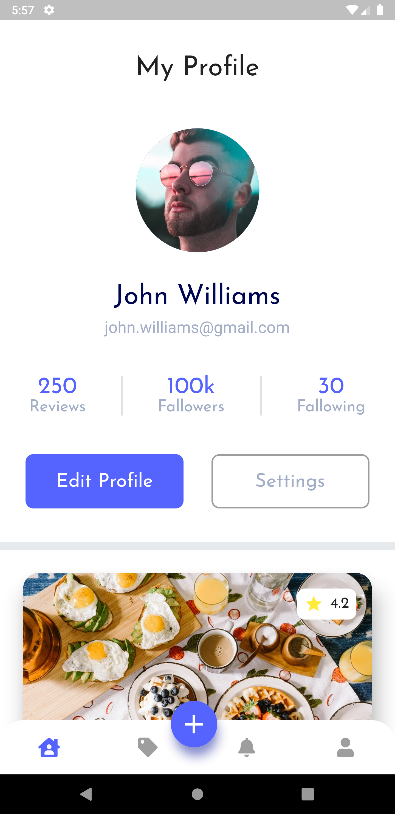
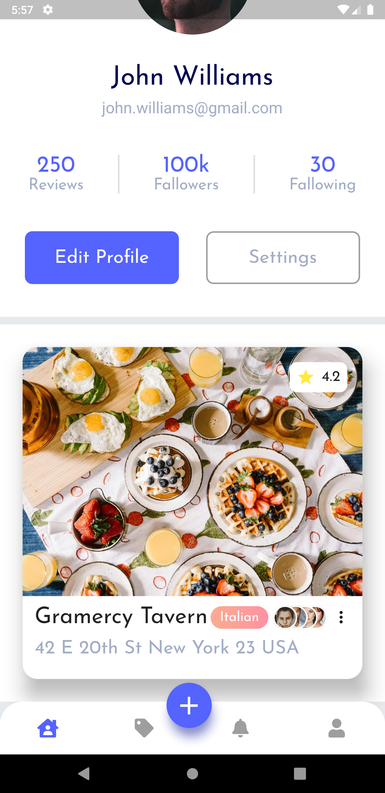

    <h1>
        <b>Practice Profile Screen</b>
    </h1>

<h2>
    <b>Español</b>
</h2>

Esta es una pequeña practica en flutter para la creación del UI avanzadas con un diseño 100% responsivo, el diseño original lo puede encontrar [aquí](https://codecanyon.net/item/flutter-foodybite-restaurant-reviews-app/27215877), la recreación de este diseño solo fue con fines educativos, por favor siéntase en la libertad de descargar este repositorio y modificarlo como quiera o analizar el código.

<h2>
    <b>English</b>
</h2>

This is a little flutter practice for creating the advanced UI with a 100% responsive design, the original design can be found [here](https://codecanyon.net/item/flutter-foodybite-restaurant-reviews-app/27215877), the recreation of this design was only for educational purposes, please feel free to download this repository and modify it as you like or analyze the code.

